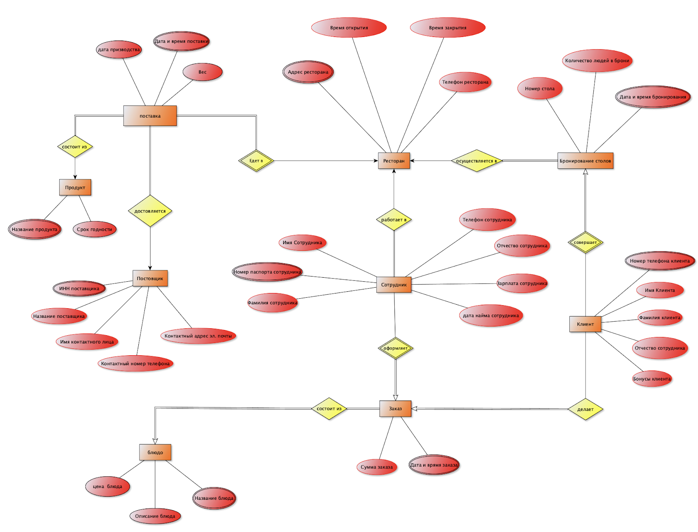
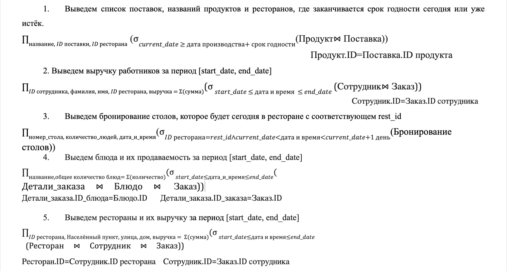
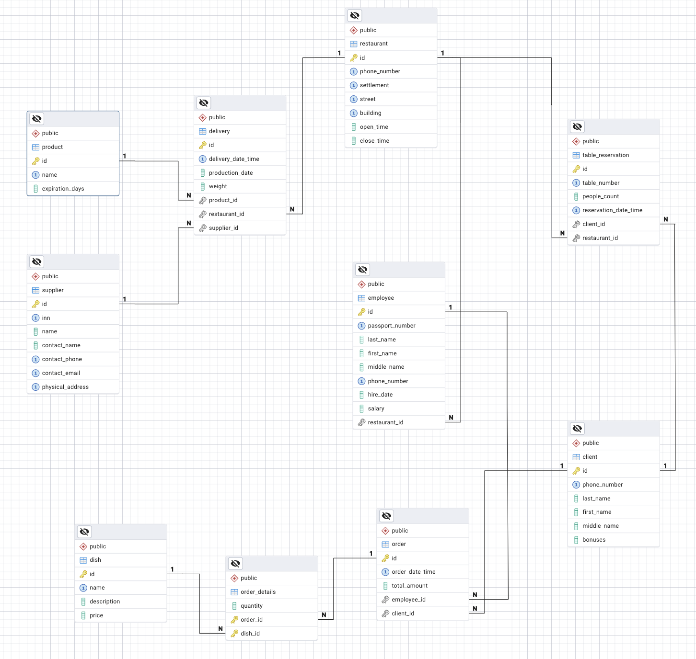

# Курсовой проект по дисциплине «Управление данными»
---
## Содержание

- **[Введение](#введение)**  
- **[Глава 1. Инфологическое моделирование предметной области](#глава-1)**  
  - [1.1. Таблица атомарных объектов](#11-таблица-атомарных-объектов)  
  - [1.2. Составление списка сущностей](#12-составление-списка-сущностей)  
  - [1.3. Диаграмма сущностей](#13-диаграмма-сущностей)  

- **[Глава 2. Даталогическое моделирование предметной области](#глава-2)**  
  - [2.1. Составление списка таблиц](#21-составление-списка-таблиц)  
  - [2.2. Нормализация таблиц до НФБК](#22-нормализация-таблиц-до-нфбк)  
  - [2.3. Итоговый список таблиц](#23-итоговый-список-таблиц)  
  - [2.4. Запросы в нотации реляционной алгебры](#24-запросы-в-нотации-реляционной-алгебры)  

- **[Глава 3. Реализация информационной системы в СУБД Postgres](#глава-3)**  
  - [3.1. Скрипт создания базы данных](#31-скрипт-создания-базы-данных)  
  - [3.2. Диаграмма базы данных](#32-диаграмма-базы-данных)  

- **[Заключение](#заключение)**  

---
<a id="введение"></a>
## Введение

### Предметная область
Сеть ресторанов.

---

### Описание

Сеть ресторанов **"Гурман"** — это быстро развивающаяся компания, которая привлекает гостей своей особенной атмосферой и высоким качеством обслуживания. Главная идея компании заключается в создании места, где каждый посетитель чувствует себя важным, а блюда радуют разнообразием и отличным исполнением.

#### Особенности компании:
- **Качество продуктов:**  
  Важное внимание уделяется качеству ингредиентов. Компания сотрудничает только с проверенными поставщиками, чтобы гарантировать свежесть и экологичность всех продуктов. Каждая поставка тщательно отслеживается, что позволяет поддерживать высочайшие стандарты на всех этапах приготовления пищи — от выбора сырья до подачи блюд.
  
- **Сеть ресторанов:**  
  "Гурман" объединяет несколько заведений, каждое из которых сохраняет общее меню, стиль и философию бренда, несмотря на региональные различия.

- **Использование технологий:**  
  Рестораны активно внедряют современные технологии для улучшения клиентского опыта:
  - Онлайн-бронирование столиков через мобильное приложение упрощает взаимодействие с клиентами, помогает избежать очередей и создаёт комфортные условия для гостей.
  - Автоматизированные системы используются для управления заказами, персоналом и запасами продуктов. Это значительно ускоряет обслуживание, повышает качество клиентского опыта и минимизирует вероятность ошибок.

- **Программа лояльности:**  
  Важной частью работы компании является программа лояльности для постоянных клиентов. Она позволяет накапливать бонусы в размере **5% от суммы заказа** за каждый визит, которые можно обменивать на скидки или бесплатные блюда. Программа помогает укреплять связь с клиентами, понимать их предпочтения и поощрять за преданность бренду.

- **Подбор и обучение персонала:**  
  Персонал тщательно отбирается и проходит обучение по стандартам сети, чтобы соответствовать высоким требованиям обслуживания.

- **Анализ и управление бизнес-процессами:**  
  Менеджмент компании следит за выручкой различных ресторанов, анализирует продаваемость блюд и контролирует доходность работы сотрудников. Это обеспечивает стабильный рост и оптимизацию бизнес-процессов.

---
<a id="глава-1"></a>
## Глава 1. Инфологическое моделирование предметной области

Инфологическое моделирование будет проводиться с использованием **восходящего метода**. При использовании этого метода вначале составляется таблица атомарных объектов. Затем, на основании этой таблицы, выделяются сущности, между которыми устанавливаются связи. Сущности и связи отображаются на диаграмме.

---
<a id="11-таблица-атомарных-объектов"></a>
### 1.1. Таблица атомарных объектов

Для приведённого во Введении описания предметной области таблица атомарных объектов будет выглядеть следующим образом:

| №  | Атомарный объект                     | От чего зависит                                                                 |
|----|--------------------------------------|---------------------------------------------------------------------------------|
| 1  | Адрес ресторана                      | Номер паспорта сотрудника                                                       |
| 2  | Телефон ресторана                    | Адрес ресторана                                                                 |
| 3  | Время открытия                       | Адрес ресторана                                                                 |
| 4  | Время закрытия                       | Адрес ресторана                                                                 |
| 5  | Дата и время бронирования            | -                                                                               |
| 6  | Количество людей в брони             | Дата и время бронирования, номер телефона клиента                               |
| 7  | Номер стола                          | Дата и время бронирования, номер телефона клиента                               |
| 8  | Название блюда                       | -                                                                               |
| 9  | Описание блюда                       | Название блюда                                                                  |
| 10 | Цена блюда                           | Название блюда                                                                  |
| 11 | Дата и время заказа                  | -                                                                               |
| 12 | Сумма заказа                         | (Дата и время заказа, номер паспорта сотрудника), (Дата и время заказа, Номер телефона клиента) |
| 13 | Номер паспорта сотрудника            | -                                                                               |
| 14 | Фамилия сотрудника                   | Номер паспорта сотрудника                                                       |
| 15 | Имя сотрудника                       | Номер паспорта сотрудника                                                       |
| 16 | Отчество сотрудника                  | Номер паспорта сотрудника                                                       |
| 17 | Зарплата сотрудника                  | Номер паспорта сотрудника                                                       |
| 18 | Дата найма сотрудника                | Номер паспорта сотрудника                                                       |
| 19 | Телефон сотрудника                   | Номер паспорта сотрудника                                                       |
| 20 | ИНН поставщика                       | Дата и время поставки, адрес ресторана                                           |
| 21 | Название поставщика                  | ИНН поставщика                                                                  |
| 22 | Имя контактного лица                  | ИНН поставщика                                                                  |
| 23 | Контактный номер телефона             | ИНН поставщика                                                                  |
| 24 | Контактный адрес электронной почты    | ИНН поставщика                                                                  |
| 25 | Физический адрес                     | ИНН поставщика                                                                  |
| 26 | Номер телефона клиента                | -                                                                               |
| 27 | Имя клиента                          | Номер телефона клиента                                                          |
| 28 | Фамилия клиента                      | Номер телефона клиента                                                          |
| 29 | Отчество клиента                     | Номер телефона клиента                                                          |
| 30 | Бонусы клиента                       | Номер телефона клиента                                                          |
| 31 | Дата и время поставки                | -                                                                               |
| 32 | Дата производства                    | Дата и время поставки, адрес ресторана                                           |
| 33 | Вес                                  | Дата и время поставки, адрес ресторана                                           |
| 34 | Название продукта                    | Дата и время поставки, адрес ресторана                                           |
| 35 | Срок годности                        | Название продукта                                                               |

---
<a id="12-составление-списка-сущностей"></a>
### 1.2. Составление списка сущностей

Ниже представлен список сущностей, выделенных на основе таблицы атомарных объектов. **Жирным шрифтом** выделены ключевые атрибуты, а *курсивом* указаны реляционные свойства (связи между сущностями).

---

#### Ресторан
- **Адрес ресторана**
- Телефон ресторана
- Время открытия
- Время закрытия

---

#### Бронирование столов
- **Дата и время бронирования**
- Количество людей в брони
- Номер стола
- *Адрес ресторана*
- *Номер телефона клиента*

---

#### Блюдо
- **Название блюда**
- Описание блюда
- Цена блюда

---

#### Заказ
- **Дата и время заказа**
- Сумма заказа
- *Номер паспорта сотрудника*
- *Номер телефона клиента*

---

#### Сотрудник
- **Номер паспорта сотрудника**
- Фамилия сотрудника
- Имя сотрудника
- Отчество сотрудника
- Дата найма сотрудника
- Телефон сотрудника
- *Адрес ресторана*

---

#### Поставщик
- **ИНН поставщика**
- Название поставщика
- Имя контактного лица
- Контактный номер телефона
- Контактный адрес электронной почты
- Физический адрес

---

#### Поставка
- **Дата и время поставки**
- Дата производства
- Вес
- *Адрес поставки (ресторана)*
- *Название продукта*
- *ИНН поставщика*

---

#### Продукт
- **Название продукта**
- Срок годности

---

#### Клиент
- **Номер телефона клиента**
- Имя клиента
- Фамилия клиента
- Отчество клиента
- Бонусы клиента

---

**Жирным шрифтом** выделены ключевые атрибуты. *Курсивом* показано реляционное свойство.

---
<a id="13-диаграмма-сущностей"></a>
### 1.3. Диаграмма сущностей
Ниже представлена диаграмма сущностей в нотации Чена.
<br><br>

<br><br>
<a id="глава-2"></a>
## Глава 2. Даталогическое моделирование предметной области 

Даталогическое моделирование будет проводиться с использованием реляционной модели данных. В качестве исходного материала берутся результаты инфологического моделирования.

---
<a id="21-составление-списка-таблиц"></a>
### 2.1. Составление списка таблиц

На основе построенной на этапе инфологического моделирования онтологии можно выделить следующие таблицы (первичный ключ выделен подчёркиванием):

- **Ресторан** (_ID_, Номер телефона, Адрес, Время открытия, Время закрытия)  
  - *Альтернативные ключи*: Номер телефона, Адрес.

- **Клиент** (_ID_, Номер телефона, Фамилия, Имя, Отчество, Бонусы)  
  - *Альтернативный ключ*: Номер телефона.

- **Бронирование столов** (_ID_, Номер стола, Количество людей в брони, Дата и время, ID клиента, ID ресторана)  
  - *Внешние ключи*:  
    - ID клиента – ссылается на _ID_ в таблице «Клиент».  
    - ID ресторана – ссылается на _ID_ в таблице «Ресторан».  
  - *Альтернативные ключи*:  
    - (Дата и время, ID клиента).  
    - (Номер стола, ID ресторана, Дата и время бронирования).

- **Сотрудник** (_ID_, Номер паспорта, Фамилия, Имя, Отчество, Телефон, Дата найма, Зарплата, ID ресторана)  
  - *Альтернативные ключи*: Номер телефона, Номер паспорта.  
  - *Внешний ключ*:  
    - ID ресторана – ссылается на _ID_ в таблице «Ресторан».

- **Заказ** (_ID_, Дата и время, Сумма, ID сотрудника, ID клиента)  
  - *Внешние ключи*:  
    - ID сотрудника – ссылается на _ID_ в таблице «Сотрудник».  
    - ID клиента – ссылается на _ID_ в таблице «Клиент».  
  - *Альтернативные ключи*:  
    - (ID сотрудника + Дата и время).  
    - (ID клиента + Дата и время).

- **Блюдо** (_ID_, Название, Описание, Цена)  
  - *Альтернативный ключ*: Название.

- **Детали заказа** (Количество блюд, ID заказа, ID блюда)  
  - *Внешние ключи*:  
    - ID заказа – ссылается на _ID_ в таблице «Заказ».  
    - ID блюда – ссылается на _ID_ в таблице «Блюдо».

- **Продукт** (_ID_, Название, Срок годности)  
  - *Альтернативный ключ*: Название.

- **Поставщик** (_ID_, ИНН, Название, Имя контактного лица, Контактный номер телефона, Контактный адрес эл. почты, Физ. адрес)  
  - *Альтернативные ключи*:  
    - ИНН.  
    - Контактный номер телефона.  
    - Контактный адрес эл. почты.  
    - Физ. адрес.

- **Поставка** (_ID_, Дата и время, Дата производства, Вес, ID продукта, ID ресторана, ID поставщика)  
  - *Внешние ключи*:  
    - ID продукта – ссылается на _ID_ в таблице «Продукт».  
    - ID поставщика – ссылается на _ID_ в таблице «Поставщик».  
    - ID ресторана – ссылается на _ID_ в таблице «Ресторан».  
  - *Альтернативный ключ*:  
    - (Дата и время + ID ресторана).
---
<a id="22-нормализация-таблиц-до-нфбк"></a>
### 2.2. Нормализация таблиц до НФБК
#### Ресторан  
**Исходная структура:**  
`Ресторан(ID, Номер телефона, Адрес, Время открытия, Время закрытия)`  

##### 1НФ  
- **ID** — это число, он не может быть причиной нарушения 1НФ.  
- **Номер телефона** — это простая строка, поэтому он не может быть причиной нарушения 1НФ.  
- **Адрес ресторана** — это нарушение 1НФ, так как в приложении, возможно, потребуется поиск, например, по населённому пункту. Исправим это, разделив адрес на: **Населённый пункт**, **Улица**, **Дом**.  
- **Время открытия**, **Время закрытия** — это информационные поля, поэтому они не могут быть причиной нарушения 1НФ.  

**Итоговая структура после приведения к 1НФ:**  
`Ресторан(ID, Номер телефона, Населённый пункт, Улица, Дом, Время открытия, Время закрытия)`  

**Альтернативные ключи:**  
- (Номер телефона);  
- (Населённый пункт, Улица, Дом).  

##### 2НФ  
Так как один из ключей таблицы составной, а также есть неключевые атрибуты, то нарушение 2НФ возможно. Зададим вопросы:  
- Может ли одному **улице** соответствовать несколько времён закрытия?  
- Может ли одному **улице** соответствовать несколько времён открытия?  
- Может ли одному **дому** соответствовать несколько времён закрытия?  
- Может ли одному **Населённому пункту и улице** соответствовать несколько времён закрытия?  
- Может ли одному **Населённому пункту и дому** соответствовать несколько времён открытия?  

**Ответ:** Да.  
Следовательно, таблица находится во 2НФ.  

##### 3НФ  
В таблице несколько неключевых атрибутов, поэтому возможно нарушение 3НФ. Зададим вопросы:  
- Могут ли одному **времени открытия** соответствовать несколько времён закрытия?  
- Может ли одному **времени закрытия** соответствовать несколько времён открытия?  

**Ответ:** Да.  
Следовательно, таблица находится в 3НФ.  

##### НФБК  
Ключ таблицы составной, поэтому нарушение НФБК, в принципе, возможно. Зададим вопросы:  
- Может ли одному **времени открытия** соответствовать несколько **Населённых пунктов**?  
- Может ли одному **времени закрытия** соответствовать несколько **улиц**?  
- Может ли одному **времени открытия и времени закрытия** соответствовать несколько **домов**?  
- Может ли одному **Населённому пункту и улице** соответствовать несколько времён закрытия?  
- Может ли одному **Населённому пункту и улице** соответствовать несколько времён открытия?  

**Ответ:** Да.  
Следовательно, таблица находится в НФБК.  

---

#### Клиент  
**Исходная структура:**  
`Клиент(ID, Номер телефона, Фамилия, Имя, Отчество, Бонусы)`  

##### 1НФ  
- **ID** — это число, он не может быть причиной нарушения 1НФ.  
- **Номер телефона** — это простая строка, поэтому он не может быть причиной нарушения 1НФ.  
- **Бонусы** — это число, оно не может быть причиной нарушения 1НФ.  
- **Фамилия**, **Имя**, **Отчество** — это атомарные объекты, они не могут быть причиной нарушения 1НФ.  

##### 2НФ  
Ключ таблицы не составной, поэтому нарушение 2НФ невозможно.  

##### 3НФ  
В таблице несколько неключевых атрибутов, поэтому возможно нарушение 3НФ. Зададим вопросы:  
- Могут ли одной **Фамилии** соответствовать несколько **Имён**?  
- Может ли одни **Бонусы** соответствовать нескольким **Фамилиям**?  
- Могут ли одному **Отчеству** соответствовать несколько **Имён**?  
- Может ли одному **Имени** соответствовать несколько **Фамилий**?  
- Может ли одни **Бонусы** соответствовать нескольким **Отчествам**?  

**Ответ:** Да.  
Следовательно, таблица находится в 3НФ.  

##### НФБК  
Ключ таблицы не составной, поэтому нарушение НФБК невозможно.  

---

#### Бронирование столов  
**Исходная структура:**  
`Бронирование столов(ID, Номер стола, Количество людей в брони, Дата и время, ID клиента, ID ресторана)`  

- **Внешние ключи:**  
  - `ID клиента` – внешний ключ, ссылающийся на `Номер телефона` в таблице «Клиент».  
  - `ID ресторана` – внешний ключ, ссылающийся на `ID` в таблице «Ресторан».  

- **Альтернативные ключи:**  
  - `(Дата и время, ID клиента)`;  
  - `(Номер стола, ID ресторана, Дата и время бронирования)`.  

---

##### 1НФ  
- **Дата и время** – это отдельный момент времени, поэтому нарушений 1НФ не будет.  
- Все остальные атрибуты таблицы будут храниться в числах или простых строках, поэтому нарушений 1НФ нет.  


##### 2НФ  
Так как один из ключей таблицы составной, а также есть неключевые атрибуты, то нарушение 2НФ возможно. Зададим вопросы:  
- Может ли одной **Дате и времени** соответствовать несколько **Количеств людей в брони**?  
- Может ли одному **ID клиента** соответствовать несколько **Количеств людей в брони**?  
- Может ли одному **Номеру стола** соответствовать несколько **Количеств людей в брони**?  
- Может ли одному **ID ресторана** соответствовать несколько **Количеств людей в брони**?  
- Может ли одной **Дате и времени** соответствовать несколько **Количеств людей в брони**?  

**Ответ:** Да.  
Следовательно, таблица находится во 2НФ.  


##### 3НФ  
В таблице один неключевой атрибут, поэтому невозможно нарушение 3НФ.  


##### НФБК  
Ключи таблицы составные, поэтому нарушение НФБК, в принципе, возможно. Зададим вопросы:  
- Может ли одному **ID клиента** соответствовать несколько **Номеров стола**?  
- Может ли одному **ID клиента** соответствовать несколько **ID ресторана**?  
- Может ли одной **Дате и времени** соответствовать несколько **ID клиента**?  
- Может ли одному **Номеру стола и ID ресторана** соответствовать несколько **Дат и времён**?  
- Может ли одному **ID ресторана, Дата и время** соответствовать несколько **ID клиента**?  

**Ответ:** Да.  
Следовательно, таблица находится в НФБК.  

---

#### Сотрудник  
**Исходная структура:**  
`Сотрудник(ID, Номер паспорта, Фамилия, Имя, Отчество, Номер телефона, Дата найма, Зарплата, ID ресторана)`  

- **Альтернативные ключи:**  
  - `Номер телефона`;  
  - `Номер паспорта`.  

- **Внешние ключи:**  
  - `ID ресторана` – внешний ключ, ссылающийся на `ID` в таблице «Ресторан».  


##### 1НФ  
- **ID** – это число, он не может быть причиной нарушения 1НФ.  
- **Номер паспорта** – это простая строка, поэтому он не может быть причиной нарушения 1НФ.  
- **Фамилия, Имя, Отчество** – это простые строки, которые атомарны.  
- **Зарплата** – это число, поэтому нарушений 1НФ невозможно.  
- **Номер телефона** – это простая строка, которая атомарна.  
- **Дата найма** – это атомарный объект.  


##### 2НФ  
Так как ключи таблицы не составные, то нарушение 2НФ невозможно.  


##### 3НФ  
В таблице несколько неключевых атрибутов, поэтому возможно нарушение 3НФ. Зададим вопросы:  
- Могут ли одной **Фамилии** соответствовать несколько **Имён**?  
- Может ли одна **Фамилия** соответствовать нескольким **Телефонам**?  
- Могут ли одному **Отчеству** соответствовать несколько **Дат найма**?  
- Может ли одна **Зарплата** соответствовать нескольким **ID ресторана**?  
- Может ли одному **Имени** соответствовать нескольким **Зарплатам**?  

**Ответ:** Да.  
Следовательно, таблица находится в 3НФ.  


##### НФБК  
Ключи таблицы не составные, поэтому нарушение НФБК невозможно. 

---

#### Заказ  
**Исходная структура:**  
`Заказ(ID, Дата и время, Сумма, ID сотрудника, ID клиента)`  

- **Внешние ключи:**  
  - `ID сотрудника` – внешний ключ, ссылающийся на `ID` в таблице «Сотрудник».  

- **Альтернативные ключи:**  
  - `(ID сотрудника + Дата и время)`;  
  - `(ID клиента + Дата и время)`.  


##### 1НФ  
- **ID**, **Сумма** – это числа, поэтому нарушений 1НФ невозможно.  
- **ID клиента**, **ID сотрудника** – это простые строки.  
- **Дата и время** – это отдельный момент времени, поэтому нарушений 1НФ не будет.  


##### 2НФ  
Так как один из ключей таблицы составной, а также есть неключевые атрибуты, то нарушение 2НФ возможно. Зададим вопросы:  
- Могут ли одной **Дате и времени** соответствовать несколько **Сумм**?  
- Может ли одному **ID сотрудника** соответствовать несколько **Сумм**?  
- Могут ли одному **ID клиента** соответствовать несколько **Сумм**?  

**Ответ:** Да.  
Следовательно, таблица находится во 2НФ.  


##### 3НФ  
В таблице один неключевой атрибут (**Сумма**), поэтому невозможно нарушение 3НФ.  


##### НФБК  
Ключи таблицы составные, поэтому нарушение НФБК, в принципе, возможно. Зададим вопросы:  
- Могут ли одной **Сумме** соответствовать несколько **Дат и времени**?  
- Может ли одной **Сумме** соответствовать несколько **ID сотрудника**?  
- Может ли одной **Сумме** соответствовать несколько **ID клиента**?  

**Ответ:** Да.  
Следовательно, таблица находится в НФБК.  

---

#### Блюдо  
**Исходная структура:**  
`Блюдо(ID, Название, Описание, Цена)`  

- **Альтернативный ключ:**  
  - `Название`.  


##### 1НФ  
- **ID**, **Цена** – это числа, поэтому нарушений 1НФ невозможно.  
- **Название**, **Описание** – это простые строки, которые атомарны.  


##### 2НФ  
Так как ключи таблицы не составные, то нарушение 2НФ невозможно.  


##### 3НФ  
В таблице несколько неключевых атрибутов, поэтому возможно нарушение 3НФ. Зададим вопросы:  
- Могут ли одной **Цене** соответствовать несколько **Описаний**?  
- Может ли одному **Описанию** соответствовать несколько **Цен**? (Будем считать, что у некоторых блюд может не быть описания, следовательно, ответ – Да.)  

**Ответ:** Да.  
Следовательно, таблица находится в 3НФ.  


##### НФБК  
Ключи таблицы не составные, поэтому нарушение НФБК невозможно.  

---


#### Детали заказа  
**Исходная структура:**  
`Детали заказа(Количество блюд, ID заказа, ID блюда)`  

- **Внешние ключи:**  
  - `ID заказа` – внешний ключ, ссылающийся на `ID` в таблице «Заказ».  
  - `ID блюда` – внешний ключ, ссылающийся на `ID` в таблице «Блюдо».  

---

##### 1НФ  
Все атрибуты таблицы являются числами, поэтому нарушений 1НФ невозможно.  


##### 2НФ  
Так как один из ключей таблицы составной, а также есть неключевые атрибуты, то нарушение 2НФ возможно. Зададим вопросы:  
- Могут ли одному `ID заказа` соответствовать несколько значений `Количество блюд`?  
- Может ли одному `ID блюда` соответствовать несколько значений `Количество блюд`?  

**Ответ:** Да.  
Следовательно, таблица находится во 2НФ.  


##### 3НФ  
В таблице один неключевой атрибут (`Количество блюд`), поэтому невозможно нарушение 3НФ.  


##### НФБК  
Ключи таблицы составные, поэтому нарушение НФБК, в принципе, возможно. Зададим вопросы:  
- Могут ли одному `Количеству блюд` соответствовать несколько `ID заказов`?  
- Может ли одному `Количеству блюд` соответствовать несколько `ID блюд`?  

**Ответ:** Да.  
Следовательно, таблица находится в НФБК.  

---

#### Продукт  
**Исходная структура:**  
`Продукт(ID, Название, Срок годности)`  

- **Альтернативный ключ:**  
  - `Название`.  


##### 1НФ  
- `ID` и `Срок годности` – это числа, поэтому нарушений 1НФ невозможно (срок годности будем считать как количество дней).  
- `Название` – это простая строка, которая атомарна.  


##### 2НФ  
Так как ключи таблицы не составные, то нарушение 2НФ невозможно.  


##### 3НФ  
В таблице один неключевой атрибут (`Срок годности`), поэтому невозможно нарушение 3НФ.  


##### НФБК  
Ключи таблицы не составные, поэтому нарушение НФБК невозможно.  
---


#### Поставщик  
**Исходная структура:**  
`Поставщик(ID, ИНН, Название, Имя контактного лица, Контактный номер телефона, Контактный адрес эл. почты, Физ. адрес)`  

- **Альтернативные ключи:**  
  - `ИНН`;  
  - `Контактный номер телефона`;  
  - `Контактный адрес эл. почты`;  
  - `Физ. адрес`.  


##### 1НФ  
- `ИНН` – это простая строка, поэтому нарушений 1НФ невозможно.  
- `Название`, `Имя контактного лица`, `Контактный адрес эл. почты`, `Физ. адрес`, `Контактный номер телефона` – это простые строки, которые атомарны (физический адрес будем считать информационным полем).  

##### 2НФ  
Так как ключи таблицы не составные, то нарушение 2НФ невозможно.  


##### 3НФ  
В таблице несколько неключевых атрибутов, поэтому возможно нарушение 3НФ. Зададим вопросы:  
- Могут ли одному `Названию` соответствовать несколько `Имён контактного лица`?  
- Может ли одному `Имени контактного лица` соответствовать несколько `Названий`?  

**Ответ:** Да.  
Следовательно, таблица находится в 3НФ.  


##### НФБК  
Ключи таблицы не составные, поэтому нарушение НФБК невозможно.  

---

#### Поставка  
**Исходная структура:**  
`Поставка(ID, Дата и время, Дата производства, Вес, ID продукта, ID ресторана, ID поставщика)`  

- **Внешние ключи:**  
  - `ID продукта` – внешний ключ, ссылающийся на `ID` в таблице «Продукт».  
  - `ID поставщика` – внешний ключ, ссылающийся на `ID` в таблице «Поставщик».  
  - `ID ресторана` – внешний ключ, ссылающийся на `ID` в таблице «Ресторан».  

- **Альтернативный ключ:**  
  - `(Дата и время + Телефон ресторана)`.  

---

##### 1НФ  
- `ID`, `Вес`, `ID продукта`, `ID поставщика` – это числа, поэтому нарушений 1НФ невозможно.  
- `Дата и время` – это отдельный момент времени, поэтому нарушений 1НФ не будет.  
- `Дата производства` – атомарный объект.  
- `Телефон ресторана` – это простая строка, которая атомарна.  


##### 2НФ  
Так как один из ключей таблицы составной, а также есть неключевые атрибуты, то нарушение 2НФ возможно. Зададим вопросы:  
- Может ли одной `Дате и времени` соответствовать несколько `Дат производства`?  
- Может ли одному `ID ресторана` соответствовать несколько `Весов`?  
- Может ли одной `Дате и времени` соответствовать несколько `ID продукта`?  
- Может ли одному `ID ресторана` соответствовать несколько `ID поставщика`?  
- Может ли одной `Дате и времени` соответствовать несколько `ID поставщика`?  

**Ответ:** Да.  
Следовательно, таблица находится во 2НФ.  


##### 3НФ  
В таблице несколько неключевых атрибутов, поэтому возможно нарушение 3НФ. Зададим вопросы:  
- Могут ли одной `Дате производства` соответствовать несколько `Весов`?  
- Может ли одной `Дате производства` соответствовать несколько `ID продукта`?  
- Может ли одной `Дате производства` соответствовать несколько `ID поставщика`?  
- Могут ли одному `ID поставщика` соответствовать несколько `Весов`?  
- Может ли одному `ID поставщика` соответствовать несколько `ID продукта`?  

**Ответ:** Да.  
Следовательно, таблица находится в 3НФ.  


##### НФБК  
Ключи таблицы составные, поэтому нарушение НФБК, в принципе, возможно. Зададим вопросы:  
- Может ли одной `Дате производства` соответствовать несколько `Дат и времени`?  
- Может ли одному `Весу` соответствовать несколько `ID ресторана`?  
- Может ли одному `ID поставщика` соответствовать несколько `Дат и времени`?  
- Может ли одному `ID поставщика` соответствовать несколько `ID ресторана`?  
- Может ли одному `Весу` соответствовать несколько `Дат и времени`?  

**Ответ:** Да.  
Следовательно, таблица находится в НФБК.  

---
<a id="23-итоговый-список-таблиц"></a>
### 2.3. Итоговый список таблиц

#### Ресторан  
`Ресторан(ID, Номер телефона, Населённый пункт, Улица, Дом, Время открытия, Время закрытия)`  
- **Альтернативные ключи:**  
  - `(Населённый пункт, Улица, Дом)`;  
  - `(Номер телефона)`.  

---

#### Клиент  
`Клиент(ID, Номер телефона, Фамилия, Имя, Отчество, Бонусы)`  
- **Альтернативный ключ:**  
  - `Номер телефона`.  

---

#### Бронирование столов  
`Бронирование столов(ID, Номер стола, Количество людей в брони, Дата и время, ID клиента, ID ресторана)`  
- **Внешние ключи:**  
  - `ID клиента` – внешний ключ, ссылающийся на `Номер телефона` в таблице «Клиент».  
  - `ID ресторана` – внешний ключ, ссылающийся на `ID` в таблице «Ресторан».  
- **Альтернативные ключи:**  
  - `(Дата и время, ID клиента)`;  
  - `(Номер стола, ID ресторана, Дата и время бронирования)`.  

---

#### Сотрудник  
`Сотрудник(ID, Номер паспорта, Фамилия, Имя, Отчество, Номер телефона, Дата найма, Зарплата, ID ресторана)`  
- **Альтернативные ключи:**  
  - `Номер телефона`;  
  - `Номер паспорта`.  
- **Внешний ключ:**  
  - `ID ресторана` – внешний ключ, ссылающийся на `ID` в таблице «Ресторан».  

---

#### Заказ  
`Заказ(ID, Дата и время, Сумма, ID сотрудника, ID клиента)`  
- **Внешние ключи:**  
  - `ID сотрудника` – внешний ключ, ссылающийся на `ID` в таблице «Сотрудник».  
  - `ID клиента` – внешний ключ, ссылающийся на `ID` в таблице «Клиент».  
- **Альтернативные ключи:**  
  - `(ID сотрудника + Дата и время)`;  
  - `(ID клиента + Дата и время)`.  

---

#### Блюдо  
`Блюдо(ID, Название, Описание, Цена)`  
- **Альтернативный ключ:**  
  - `Название`.  

---

#### Детали заказа  
`Детали заказа(Количество блюд, ID заказа, ID блюда)`  
- **Внешние ключи:**  
  - `ID заказа` – внешний ключ, ссылающийся на `ID` в таблице «Заказ».  
  - `ID блюда` – внешний ключ, ссылающийся на `ID` в таблице «Блюдо».  

---

#### Продукт  
`Продукт(ID, Название, Срок годности)`  
- **Альтернативный ключ:**  
  - `Название`.  

---

#### Поставщик  
`Поставщик(ID, ИНН, Название, Имя контактного лица, Контактный номер телефона, Контактный адрес эл. почты, Физ. адрес)`  
- **Альтернативные ключи:**  
  - `ИНН`;  
  - `Контактный номер телефона`;  
  - `Контактный адрес эл. почты`;  
  - `Физ. адрес`.  

---

#### Поставка  
`Поставка(ID, Дата и время, Дата производства, Вес, ID продукта, ID ресторана, ID поставщика)`  
- **Внешние ключи:**  
  - `ID продукта` – внешний ключ, ссылающийся на `ID` в таблице «Продукт».  
  - `ID поставщика` – внешний ключ, ссылающийся на `ID` в таблице «Поставщик».  
  - `ID ресторана` – внешний ключ, ссылающийся на `ID` в таблице «Ресторан».  
- **Альтернативный ключ:**  
  - `(Дата и время + Телефон ресторана)`.
---
<a id="24-запросы-в-нотации-реляционной-алгебры"></a>
### 2.4. Запросы в нотации реляционной алгебры
<br><br>

<br><br>
---
<a id="глава-3"></a>
## Глава 3. Реализация информационной системы в субд Postgres

Для реализации информационной системы была выбрана **СУБД Postgres** и среда разработки **PgAdmin**.
<a id="31-скрипт-создания-базы-данных"></a>
### 3.1. Скрипт создания базы данных 
Вы можете найти полный исходный код в файле [script.sql](script.sql).
Примеры кода:
- Ранжирование работников по выручке за период
``` sql
SELECT 
    e.id, 
    e.last_name, 
    e.first_name, 
	restaurant_id,
    SUM(o.total_amount) AS revenue,
    DENSE_RANK() OVER (ORDER BY SUM(o.total_amount) DESC) AS rank_employee
FROM employee e 
JOIN "order" o ON e.id = o.employee_id
WHERE o.order_date_time BETWEEN start_date AND end_date
GROUP BY e.id, e.last_name, e.first_name
ORDER BY revenue DESC;
```
- Триггер для добавления бонусов при заказе
``` sql
CREATE OR REPLACE FUNCTION add_bonuses_to_client() 
RETURNS TRIGGER 
LANGUAGE 'plpgsql' AS 
$$
BEGIN
    UPDATE client
    SET bonuses = bonuses + ROUND(NEW.total_amount * 0.05)
    WHERE id = NEW.client_id;
    RETURN NEW;
END;
$$;


CREATE OR REPLACE TRIGGER trigger_add_bonuses
AFTER INSERT ON "order"
FOR EACH ROW
EXECUTE FUNCTION add_bonuses_to_client();
```
- Ранжирование ресторанов по выручке
``` sql
SELECT 
    r.id AS restaurant_id,
    r.settlement, 
    r.street, 
    r.building, 
    SUM(o.total_amount) AS revenue,
    DENSE_RANK() OVER (ORDER BY SUM(o.total_amount) DESC) AS restaurant_rank
FROM restaurant r
JOIN employee e ON r.id = e.restaurant_id
JOIN "order" o ON e.id = o.employee_id
WHERE o.order_date_time BETWEEN start_date AND end_date
GROUP BY r.id, r.settlement, r.street, r.building;
```
<a id="32-диаграмма-базы-данных"></a>
### 3.2 Диаграмма базы данных

<a id="заключение"></a>
## Заключение
В ходе работы над курсовым проектом было проведено инфологическое моделирование предметной области. В результате этого моделирования была описана онтология из 9 сущностей, представленная на диаграмме (Рисунок 1). На основе этой онтологии была спроектирована реляционная база данных из 10 таблиц. Эта база данных была реализована на базе СУБД Postgres с помощью среды разработки pgAdmin 4. Все задачи по разработке информационной системы сеть ресторанов "Гурман" успешно выполнены. Был получен опыт инфологического и даталогического моделирования, опыт работы со средой разработки БД и СУБД Postgres. 
